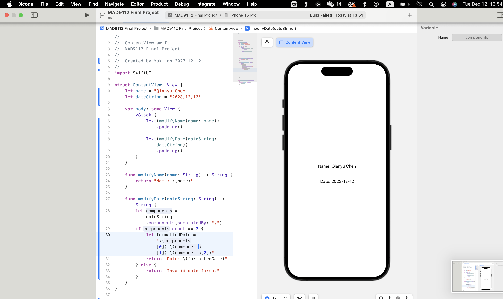
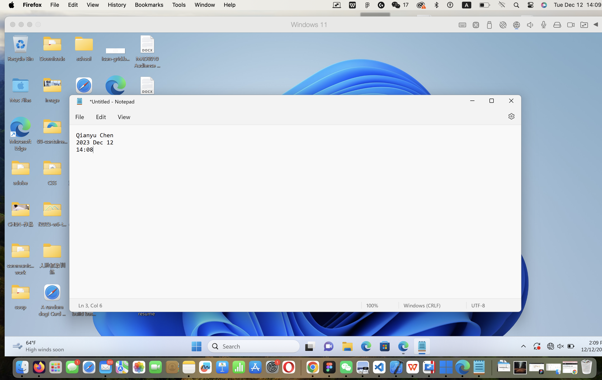

# Qianyu_Chen_Finalproject


##step 1 

```
function getDaysUntilChristmas() {
  
    const currentDate = new Date();
    const currentYear = currentDate.getFullYear();
  
   
    const christmasMonth = 11; 
    const christmasDay = 25;
    const christmasDate = new Date(currentYear, christmasMonth, christmasDay);
    const timeUntilChristmas = christmasDate - currentDate;

    const daysUntilChristmas = Math.ceil(timeUntilChristmas / (1000 * 60 * 60 * 24));
  
    console.log(`It's that time of the year when Santa's sleigh is in the shop for a tune-up, and the elves are stress-eating candy canes.`);
    console.log(`Only ${daysUntilChristmas} days left until the big guy in the red suit invades your chimney space!`);
    console.log(`Don't forget to spread the Christmas cheer - counting down the days until you find out if you're on the naughty or nice list!`);


    return daysUntilChristmas;
}
const daysRemaining = getDaysUntilChristmas();
console.log(`Days until Christmas: ${daysRemaining}`);

```


##step 3


##step 4



